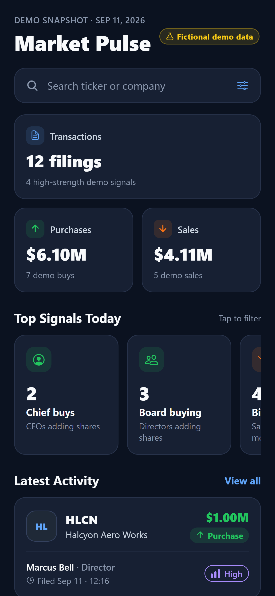
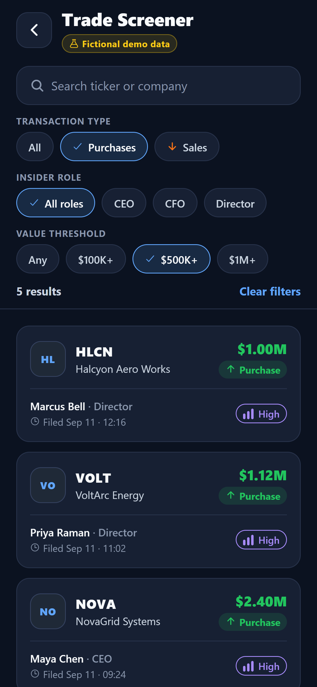
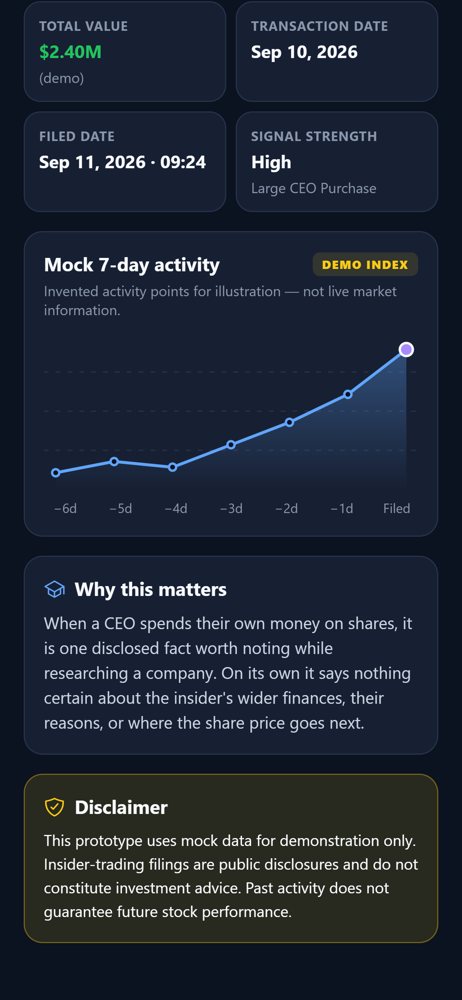

# Insider Pulse

A three-screen React Native (Expo + TypeScript) prototype for scanning fictional insider-activity signals on a phone.

> Original mobile concept inspired by the broad insider-activity product category; all displayed content is fictional mock/demo data.

| Market Pulse | Screener | Trade Details |
| --- | --- | --- |
|  |  |  |

## Project overview

Insider transaction disclosures are dense and hard to skim on a small screen. This prototype explores how a mobile app could turn that kind of activity into a quick flow: see a snapshot, narrow down to the trades you care about, then understand one trade in a few seconds. It is a design and engineering exercise, not an investing tool.

## Concept and data statement

- This is an original mobile concept inspired by the broad product category that StockInsider.io belongs to.
- StockInsider.io was **not** used as a data, copy or UI source. Nothing was scraped, screenshotted, copied or downloaded from it, the SEC, or any market-data API.
- Every company, ticker, person, share count, price, date, signal name and chart point lives in [`src/data/mockTrades.ts`](src/data/mockTrades.ts) and was invented for this project.
- The app makes no network or API calls.

## Screens and features

**1. Market Pulse (Home)**
- Header with a "Fictional demo data" badge and the demo snapshot date.
- "Search ticker or company" entry. Tapping it opens the Screener with the search field already focused.
- Three summary cards (transactions, purchase value, sale value). All three are calculated from the local array, so they always match the Screener.
- **Top Signals Today**: three original groupings ("Chief buys", "Board buying", "Big-ticket sales") with live counts. Tapping one opens the Screener with those filters already applied.
- **Latest Activity**: the four most recent filings. Each card opens its Details screen. "View all" and a bottom CTA open the Screener.

**2. Trade Screener**
- Case-insensitive search on ticker **or** company name.
- Three independent filter groups: transaction type (All / Purchases / Sales), insider role (All roles / CEO / CFO / Director) and value threshold (Any / $100K+ / $500K+ / $1M+). "Officer" trades only appear under All roles.
- Search and all filters combine. A live "N results" line shows the effect of each change.
- Empty state ("No fictional demo trades match those filters.") with a Clear filters button that resets search and filters.

**3. Trade Details**
- Back button, company name, ticker, sector and a "FICTIONAL DEMO DATA" badge.
- Signal card (for example "Large CEO Purchase / $2.40M fictional demo insider buy").
- Grid with insider and role, transaction type and code, shares, price per share, total value, transaction date, filed date and signal strength.
- **Mock 7-day activity**: a custom SVG line chart drawn from each trade's own invented seven-point index.
- "Why this matters" text written for purchases and sales separately.
- The required disclaimer, word for word.

## Tech stack

- Expo SDK 57, React Native 0.86, React 19, TypeScript (strict)
- React Navigation 7 (native stack)
- `react-native-svg` for the chart
- `@expo/vector-icons` (Ionicons)
- `react-native-safe-area-context`
- EAS Build for the Android APK

## Setup

```bash
git clone <this-repo-url>
cd insider-pulse
npm install
npx expo start
```

Then scan the QR code with Expo Go (Android/iOS), or press `a` to open an Android emulator. `npm run web` runs a browser preview.

Type-check:

```bash
npx tsc --noEmit
```

Build an installable APK (needs a free Expo account):

```bash
npx eas-cli login
npx eas-cli build -p android --profile preview
```

## Project structure

```
src/
  data/mockTrades.ts          12 fictional trades
  types/trade.ts              InsiderTrade model
  navigation/AppNavigator.tsx stack + typed route params
  screens/                    HomeScreen, ScreenerScreen, TradeDetailsScreen
  components/                 TradeCard, FilterChip, SummaryCard, SignalBadge,
                              MockActivityChart, TradeTypeTag, TickerMark,
                              DemoBadge, BackButton
  theme/colors.ts             colour, spacing and radius tokens
  utils/                      formatters, filterTrades, summary
```

Only a trade ID goes through navigation. Screens read the local mock import directly, and filter state is plain React state. For a small prototype like this, a global store would be unnecessary.

## Mobile design decisions

- **Easy to scan.** Every trade card has the same layout: ticker and company on the left, value and direction on the right, insider and filing time underneath.
- **Direction never relies on colour alone.** Purchase and Sale always appear as text, an arrow icon and a colour (green or orange), so they stay readable for colour-blind users and in grayscale.
- **Signal strength uses neutral colours.** Violet, blue and slate bars describe how notable the data is. Green and red are avoided there so strength doesn't look like a buy or sell call.
- **Filters are horizontal chip rows.** Each group has a label and its own scrolling row, so every option is one tap away and a check mark shows what's selected. The result count updates right away.
- **Fictional data is labelled everywhere.** Each screen has a demo badge, the chart is labelled "Mock 7-day activity / DEMO INDEX", and the disclaimer sits at the end of every Details page.
- **Built for touch.** Touch targets are at least 36–44 px, spacing follows an 8-point rhythm (8/12/16/20/24), and cards use a 16 px radius with subtle borders instead of heavy shadows. Company names truncate instead of pushing the layout wider, and the layout was checked at 375 and 390 px widths.
- **Accessibility.** Icon-only buttons have `accessibilityLabel`s, cards announce a full sentence summary, and chips report their selected state.

## Known limitations

- Static local data only: no live filings, no backend, no authentication, portfolio, watchlists or alerts.
- The "today" snapshot date is fixed at Sep 11, 2026 as part of the demo.
- The chart is a fixed illustrative index. It has no axis values or interaction.
- Tested on Android (APK) and in a mobile-sized web preview. It has not been tested on a physical iOS device.

## AI-use disclosure

- **Claude Code (Anthropic)** extracted the requirements from the assignment PDF, scaffolded the Expo project, and drafted the screens, components, mock data, filter logic and this README. It also ran the type-check, drove a mobile-sized web preview to test search, filters, the empty state and navigation, and captured the screenshots in `docs/screenshots/`.
- I reviewed, ran and tested the submitted code and can explain every design and implementation decision in it.

<!-- Edit the disclosure above so it matches exactly how you worked before submitting. -->

## Deliverables

- GitHub repository: _add link_
- Google Drive folder (APK, screenshots, demo video): _add link_
